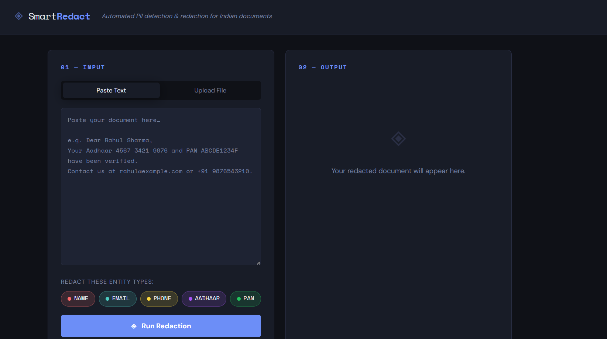
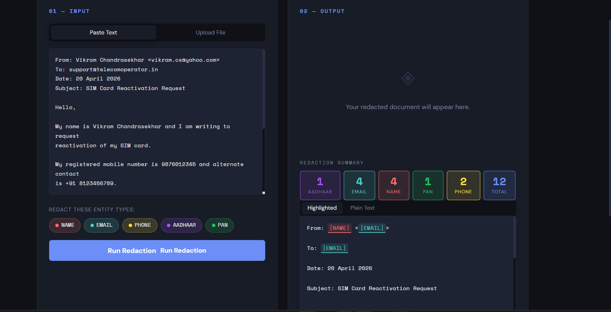
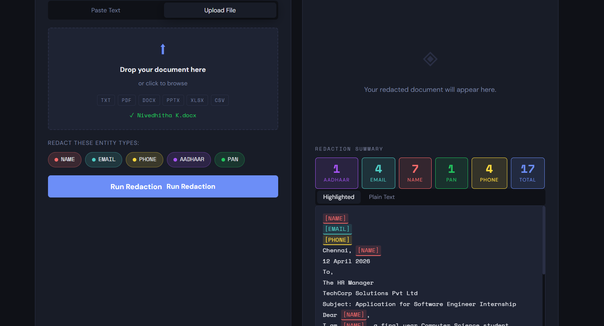
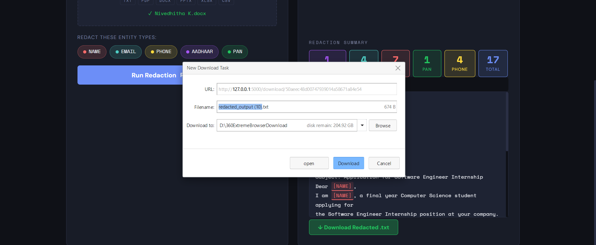

🔒 Smart Redaction Tool (Flask-Based)

A powerful AI-powered redaction system that detects and hides sensitive information from text and documents automatically to ensure privacy and security.

🚀 Features

✅ Text Redaction

Detects sensitive data like:
Names
Phone numbers
Emails

✅ Document Redaction

Upload documents (TXT / PDF supported)
Automatically detects:
Name
Email
Phone number

✅ File Download

Download redacted files instantly after processing

✅ Logging System

Stores redaction history in SQLite database

🖼️ Screenshots

🏠 Homepage

📝 Text Redaction

📄 Document Redaction

⬇️ Download Output

🏗️ Project Structure

REDACTION_TOOL/
│
├── static/
│   ├── app.js
│   └── style.css
│
├── templates/
│   └── index.html
│
├── app.py                # Main Flask App
├── database.py           # Database handling
├── file_parser.py        # File reading logic
├── redactor.py           # Core redaction logic
├── redaction_log.db      # SQLite database
├── requirements.txt
└── .gitignore

⚙️ Technologies Used
Frontend: HTML, CSS, JavaScript
Backend: Python (Flask)
Database: SQLite
Processing: Regex-based detection

🧠 How It Works
User enters text or uploads document
Flask backend receives data
redactor.py processes sensitive info
Data is masked securely
Output is displayed or downloadable
Activity logged in database

📜 License

MIT License

👩‍💻 Author

Nivedhitha K

